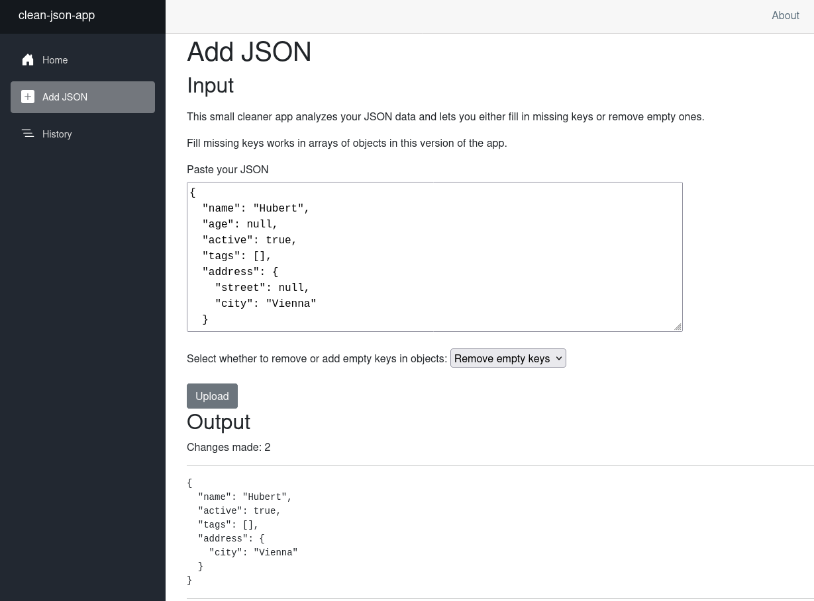

# Clean JSON App

> Small Blazor app for cleaning and restructuring JSON data.

I wanted to explore Blazor and C# with a bounded project, so I built a small app for cleaning and restructuring JSON data.

## Overview

The app currently supports:

- Removing empty keys from JSON objects
- Filling missing keys in arrays of objects
- Tracking how many changes were made
- Saving processed JSON outputs to browser localStorage
- Viewing JSON history with timestamps and metadata

## Screenshot



## Tech

- C#
- ASP.NET Blazor
- System.Text.Json
- JavaScript interop / localStorage

## Notes

The project was built as a small learning project while exploring:

- recursive JSON traversal
- Blazor component lifecycle
- localStorage persistence
- serialization/deserialization
- recursive reconstruction patterns

## Running locally

Bash in clean-json-app/

```
dotnet run
```

or in root

```
dotnet run --project clean-json-app/
```

Then open the local development URL shown in the terminal.

## Tests

Tests are structured like:

```
clean-json/
├── clean-json-app/
└── CleanJsonApp.Tests/
```

Inside CleanJsonApp.Tests/:

```
dotnet test
```

## License

- The code in this repository is licensed under the [MIT License](./LICENSE).
